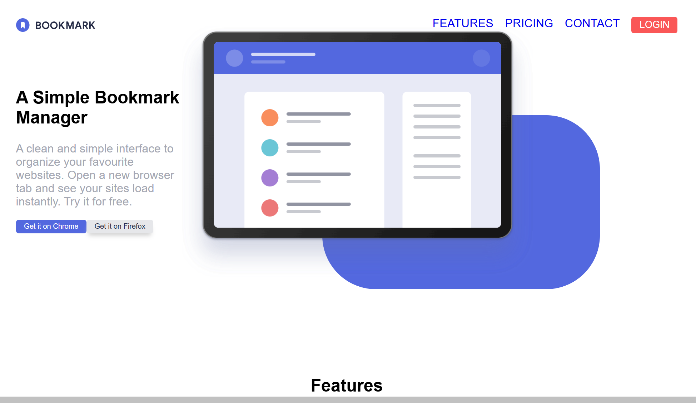

# Frontend Mentor - Bookmark landing page solution

This is a solution to the [Bookmark landing page challenge on Frontend Mentor](https://www.frontendmentor.io/challenges/bookmark-landing-page-5d0b588a9edda32581d29158). Frontend Mentor challenges help you improve your coding skills by building realistic projects. 

## Table of contents

- [Overview](#overview)
  - [The challenge](#the-challenge)
  - [Screenshot](#screenshot)
  - [Links](#links)
- [My process](#my-process)
  - [Built with](#built-with)
  - [What I learned](#what-i-learned)
  - [Continued development](#continued-development)
  - [Useful resources](#useful-resources)
- [Author](#author)

## Overview

### The challenge

Users should be able to:

- View the optimal layout for the site depending on their device's screen size
- See hover states for all interactive elements on the page
- Receive an error message when the newsletter form is submitted if:
  - The input field is empty
  - The email address is not formatted correctly

### Screenshot

### Links

- Solution URL: [Github](https://github.com/cmb347827/bookmark-landing-page-master-without-bootstrap)
- Live Site URL: [Live Github](https://cmb347827.github.io/bookmark-landing-page-master-without-bootstrap/)

## My process

### Built with

- Semantic HTML5 markup
- Sass/SCSS
- Bootstrap
- jQuery/Javascript
- Mobile-first workflow

### What I learned
  
- I started the use of patterns from the W3. I used the html code , as close as possible , and implemented my own js and css code , otherwise I'm just copying /pasting everything and do not learn a thing. The use of the W3 html pattern code , with ARIA, ensures the correct accessiblity code.
- I used W3 patterns for both the tabs and accordion. 
- And off course I removed all traces of Bootstrap, as I heard it's better not to use and to just stick to CSS/SCSS.
  Bootstrap served me well, but from now on I will not be using it , unless asked to by future employers.
- I still have used a little jQuery as some methods more convenient in jQuery , in my case toggleClass() etc.
- I also decided to ,again, just add the font I'm using , instead of linking to it, as it reduces resource loading time.
- I used a report from lighthouse to check how my page did, and it was all 90+ for both mobile and desktop.
- I could have used 'lazy loading' of images as well, but my page results seem okay so I left it at that.
  
  

### Continued development

- Daily tutorials and projects in HTML5, CSS3, Javascript, Bootstrap, Sass/SCSS. For now, in time I will go re-learn React ect.

### Useful resources

 [W3 tabs pattern](https://www.w3.org/WAI/ARIA/apg/patterns/tabs/)

## Author

- Website - [One of my latest codepens](https://codepen.io/cynthiab72/pen/oNybYON)
- Frontend Mentor - [@cmb347827](https://www.frontendmentor.io/profile/cmb347827)

